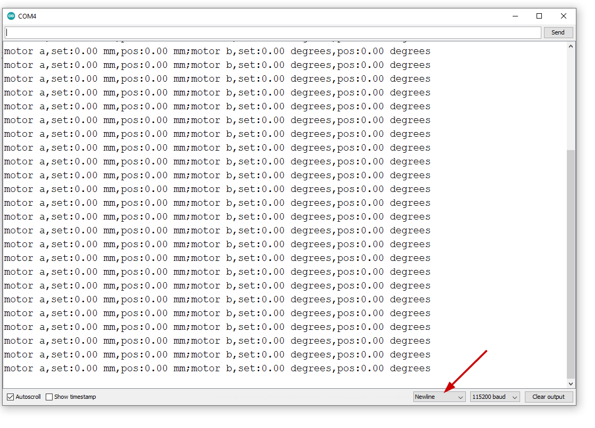

# Motor Control Tutorial

This tutorial will guide you through setting up and testing the motor control code on your Arduino using Visual Studio Code and PlatformIO.

## Setup

1. **Software**:
   - Install Visual Studio Code from [here](https://code.visualstudio.com/).
   - Install PlatformIO extension for Visual Studio Code from [here](https://platformio.org/install/ide?install=vscode).
   - Install the Arduino IDE from [here](https://www.arduino.cc/en/software) (for the Serial Monitor).

## Code Upload

1. **Open Visual Studio Code**.
2. **Open the Existing Project**:
   - Click on the PlatformIO icon in the left sidebar.
   - Click on `Open Project` and navigate to the directory where the project is located on your PC.
3. **Adjust User Adjustable Variables** (if needed):
   - Open the `src/main.cpp` file.
   - Modify the user adjustable variables as needed (e.g., `CPR`, `GEAR_REDUCTION_RATIO`, PID tunings).

```cpp
// User Adjustable Variables
// You can adjust these variables according to your needs. Changing these values will affect how the motor operates.

// Counts per revolution (CPR) of the motor encoder
#define CPR 12 

// Gear reduction ratio of the motor
#define GEAR_REDUCTION_RATIO 5 

// Linear advance per revolution in mm
#define LINEAR_ADVANCE_PER_REVOLUTION_MM 10.0 

// PID tunings for Motor A
#define MOTOR_A_P 0.7
#define MOTOR_A_I 0.09
#define MOTOR_A_D 0.01

// PID tunings for Motor B
#define MOTOR_B_P 0.7
#define MOTOR_B_I 0.09
#define MOTOR_B_D 0.01

// --- End of User Adjustable Variables ---
```

4. **Build and Upload**:
   - Click the checkmark icon (Build) in the bottom toolbar.
   - Click the right arrow icon (Upload) in the bottom toolbar.

---

## Serial Monitor Setup

1. **Open the Arduino IDE**:
   - Open the Arduino IDE installed previously.
2. **Open the Serial Monitor**:
   - Go to `Tools` > `Serial Monitor` or click the magnifying glass icon in the top right corner of the Arduino IDE.
3. **Set the Baud Rate**:
   - Set the baud rate to `115200`.
4. **Set Line Ending**:
   - Ensure the line ending option is set to `Newline`.

**Note:** It is crucial to set the line ending to `Newline` for the commands to be processed correctly.



## Commands

You can control the motors using the following commands via the Serial Monitor:

1. **Move Motor to a Specific Position**:
   - Command: `MOVE <motor> <value>`
   - Example: `MOVE A 10` (Moves motor A to 10 mm)
   - Example: `MOVE B 90` (Moves motor B to 90 degrees)

2. **Move Motor in a Sine Wave Pattern**:
   - Command: `SIN <motor> <amplitude>`
   - Example: `SIN A 10` (Moves motor A in a sine wave with 10 mm amplitude)
   - Example: `SIN B 10` (Moves motor B in a sine wave with 10 degrees amplitude)

3. **Stop Motor**:
   - Command: `STOP <motor>`
   - Example: `STOP A` (Stops motor A)
   - Example: `STOP B` (Stops motor B)
   - Use `STOP *` to stop both motors

4. **Set Virtual Position**:
   - Command: `SETVIRTUAL <motor> <position>`
   - Example: `SETVIRTUAL A 0` (Sets the current position of motor A as 0 mm)
   - Example: `SETVIRTUAL B 45` (Sets the current position of motor B as 45 degrees)

5. **Set Frequency for Sine Wave**:
   - Command: `FREQ <motor> <frequency>`
   - Example: `FREQ A 0.5` (Sets the frequency for motor A's sine wave to 0.5 Hz)

6. **Set PID Values**:
   - Command: `PID <motor> <P> <I> <D>`
   - Example: `PID A 0.7 0.09 0.01` (Sets PID values for motor A)

7. **Get Status**:
   - Command: `STATUS`
   - Displays current PID values, frequencies, and other settings

8. **Set Reporting Mode**:
   - Command: `REPORT <mode> <interval>`
   - Modes: `P` for Plot, `T` for Terminal, `N` for None
   - Example: `REPORT P 100` (Sets Plot reporting mode with 100ms interval)

## Expected Output

After entering the commands, you should see the status of both motors printed in the Serial Monitor:

```
A_set:10.00,A_pos:10.12,A_steps:86,B_set:0.00,B_pos:0.00
A_set:10.00,A_pos:10.12,A_steps:86,B_set:0.00,B_pos:0.00
A_set:10.00,A_pos:10.12,A_steps:86,B_set:0.00,B_pos:0.00
...
```

The output will continuously update, showing the current setpoints and positions of the motors.

## Adjusting PID Tunings

The PID tunings for both motors can be adjusted in the code:

```cpp
// PID tunings for Motor A
#define MOTOR_A_P 0.7
#define MOTOR_A_I 0.09
#define MOTOR_A_D 0.01

// PID tunings for Motor B
#define MOTOR_B_P 0.7
#define MOTOR_B_I 0.09
#define MOTOR_B_D 0.01
```

Modify these values to improve the stability and performance of the motors according to your application needs.

---

This guide should help you set up and test the motor control code effectively. If you have any issues, feel free to ask for further assistance.